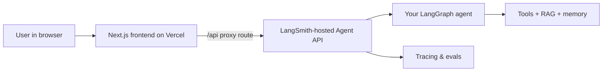

<p align="center" draggable="false">
</p>

<h1 align="center" id="heading">Session 9: Agent Servers</h1>

### [Quicklinks]()

| Session Sheet                                                                                                                                                              | Recording                                                                                                                                                   | Slides                                                 | Repo          | Homework                                                    | Feedback                                            |
| :------------------------------------------------------------------------------------------------------------------------------------------------------------------------- | :---------------------------------------------------------------------------------------------------------------------------------------------------------- | :----------------------------------------------------- | :------------ | :---------------------------------------------------------- | :-------------------------------------------------- |
| [Session 9: Agent Servers & E2E Agents](https://github.com/AI-Maker-Space/The-AI-Engineering-Certification-v1.0/tree/main/00_Docs/Modules/09_Agent_servers_%26_E2E_Agents) | [Recording!](https://us02web.zoom.us/rec/share/ByhPGNz-CQ4C9k859VnRIoGPfkS4AdBzLPQiCIgEafYiDjYxtNXUjidTI1dM-79R.oCxzwNn0SyVAWj88) <br> passcode: `r14dvS$V` | [Session 9 Slides](https://canva.link/yqymnzjmzhpnyiy) | You are here! | [Session 9 Assignment](https://forms.gle/PMmqBBLZ8d8fGg1L8) | [Feedback 7/1](https://forms.gle/36tnHPpeS562DD3fA) |

## Useful Resources

**LangSmith Deployment & Studio**

- [LangSmith Deployment docs](https://docs.langchain.com/langsmith/deployments) — Deploy, manage, and monitor agent APIs
- [LangGraph Studio](https://docs.langchain.com/langgraph-platform/langgraph-studio) — Visualize, debug, and test agents locally and in production
- [Agent Server API](https://docs.langchain.com/langsmith/agent-server) — Threads, runs, assistants, and streaming
- [You don't know what your agent will do until it's in production](https://blog.langchain.com/you-dont-know-what-your-agent-will-do-until-its-in-production/)

**Frontend Integration**

- [`@langchain/react` — `useStream` hook](https://www.npmjs.com/package/@langchain/react) — Stream agent responses in React/Next.js
- [`langgraph-nextjs-api-passthrough`](https://www.npmjs.com/package/langgraph-nextjs-api-passthrough) — Secure Next.js API routes that proxy to your deployed agent without exposing keys in the browser
- [Next.js on Vercel](https://vercel.com/docs/frameworks/nextjs) — Deploy the frontend
  npm run dev # chat UI at http://localhost:3000, ensure LANGGRAPH_API_URL is set to /api

## What You Are Building

In earlier sessions, you built LangGraph agents in notebooks. In this session, you take that agent to production in two parts:

1. **Deploy the agent** as a LangSmith-hosted API backend
2. **Build a website** that talks to that agent, then **deploy the site on Vercel**



> **Important:** Vercel still hosts the UI, but the agent backend is hosted on LangSmith. The browser should still only talk to the Next.js proxy route.

## Main Assignment

You will package a LangGraph agent into a production-ready Python project, test it in **LangGraph Studio**, deploy it with LangSmith, then build a **Next.js chat UI** that streams responses from your deployed agent and ship that UI to **Vercel**.

Expected agent project layout:

```text
09_Agent_Servers/
├── app/
│   ├── state.py            # Shared state schema
│   ├── models.py           # Model factory
│   ├── tools.py            # Tool belt
│   ├── rag.py              # Optional RAG pipeline
│   └── graphs/
│       └── simple_agent.py
├── data/
│   └── cat-health-guide.pdf
└── frontend/               # Next.js app (you create this)
    └── app/
        ├── page.tsx
        └── api/[...path]/route.ts
```

## Prerequisites

In addition to tools from earlier sessions, you will need:

1. A [LangSmith](https://smith.langchain.com/) account
2. LangSmith Deployments access enabled for your org
3. Your agent code pushed to a **GitHub** repository
4. A [Vercel](https://vercel.com/) account

## Quick Command Reference

Two servers run **locally** (the agent API and the frontend), and the backend deployment path uses LangSmith. Run commands from `09_Agent_Servers/` unless noted. The detailed walkthrough for each step is in Parts 1–4 below.

### Run locally

**1. Agent server (LangGraph) — terminal 1**

```bash
uv sync                            # install Python deps (first time only)
cp .env.example .env               # then fill in OPENAI_API_KEY and TAVILY_API_KEY
uv run langgraph dev               # API at http://localhost:2024 + opens LangGraph Studio
```

**2. Frontend (Next.js) — terminal 2**

```bash
cd frontend
npm install                        # install JS deps (first time only)
cp .env.local.example .env.local   # defaults already point at http://localhost:2024
npm run dev                        # chat UI at http://localhost:3000
```

Open `http://localhost:3000` and chat. The browser hits the Next.js `/api` proxy, which forwards to your local agent server.

### Deploy online

**3. Agent → LangSmith-hosted deployment** (run from `09_Agent_Servers/`)

```bash
uv run langgraph deploy
```

Use the hosted deployment URL returned by LangSmith as the value for `LANGGRAPH_API_URL` in the frontend project.

**4. Frontend → Vercel** (run from `frontend/`)

```bash
npm install -g vercel              # install the Vercel CLI (first time only)
cd frontend
vercel                             # first run links/creates the project (preview deploy)
vercel --prod                      # production deploy
```

Set these in the Vercel project (Settings → Environment Variables, or `vercel env add`), then run `vercel --prod` again:

```text
LANGGRAPH_API_URL=https://your-backend.example.com
LANGSMITH_API_KEY=lsv2_pt_...
NEXT_PUBLIC_API_URL=https://your-app.vercel.app/api
```

## Setup

From this folder, install the agent environment:

```bash
uv sync
```

Copy the example env file and fill in your keys:

```bash
cp .env.example .env
```

Typical variables:

```text
OPENAI_API_KEY=
TAVILY_API_KEY=
LANGSMITH_API_KEY=
LANGSMITH_TRACING=true
LANGSMITH_ENDPOINT=
```

## Part 1: Run Locally and Use LangGraph Studio

Package your agent so it can be served as an API — not as a notebook cell.

### 1. Define your graphs in `langgraph.json`

Register each compiled graph and the assistants you want to expose:

```json
{
  "dependencies": ["."],
  "env": ".env",
  "graphs": {
    "simple_agent": "app.graphs.simple_agent:graph"
  },
  "assistants": {
    "agent": {
      "graph_id": "simple_agent",
      "name": "Simple Agent",
      "description": "Agent with tools using conditional tool-calling."
    }
  }
}
```

Each graph file should export a compiled graph named `graph`.

### 2. Start the local agent server

```bash
uv run langgraph dev
```

This starts the agent API at `http://localhost:2024` and opens **LangGraph Studio** in your browser (Chromium-based browsers work best).

### 3. Explore and debug in Studio

Use Studio to:

- Visualize graph topology — nodes, edges, and conditional branches
- Step through execution and inspect tool calls and results
- Fork conversations to test alternate paths
- Switch between assistants defined in `langgraph.json`

Studio and the SDK stream the same events. Studio is for debugging; the SDK (and your frontend) is for production integration.

### 4. Smoke-test with the SDK

```python
from langgraph_sdk import get_client

client = get_client(url="http://localhost:2024")

for chunk in client.runs.stream(
    None,
  "simple_agent",
    input={"messages": [{"role": "human", "content": "How often should I deworm my cat?"}]},
    stream_mode="updates",
):
    print(chunk)
```

If this works locally, you are ready to deploy. For the deployed backend, use the assistant id exposed by your runtime.

## Part 2: Deploy the Agent on LangSmith

Deploy the agent to LangSmith so the hosted runtime exposes the API for the frontend.

```bash
uv run langgraph deploy
```

Use the hosted deployment URL returned by LangSmith as the value for `LANGGRAPH_API_URL` in the frontend project.

### What you get

A hosted backend API endpoint with standard routes for threads, runs, and assistants. LangSmith handles the runtime; tracing and monitoring live in the LangSmith project.

## Part 3: Build a Website That Uses Your Agent

Create a Next.js frontend that streams chat responses from your deployed agent.

### Recommended architecture

Never put backend credentials in client-side code. Use a **Next.js API route** as a secure proxy:

```text
Browser  →  /api/* on Vercel  →  Backend API URL
              (injects backend key server-side)
```

### 1. Scaffold the frontend

From this folder:

```bash
npx create-next-app@latest frontend
cd frontend
npm install @langchain/react langgraph-nextjs-api-passthrough
```

### 2. Add the API passthrough route

Create `frontend/app/api/[...path]/route.ts`:

```typescript
import { initApiPassthrough } from "langgraph-nextjs-api-passthrough";

export const { GET, POST, PUT, PATCH, DELETE, OPTIONS, runtime } =
  initApiPassthrough({
    apiUrl: process.env.LANGGRAPH_API_URL,
    apiKey: process.env.LANGSMITH_API_KEY,
    runtime: "edge",
  });
```

### 3. Build the chat UI with `useStream`

In a client component (e.g. `frontend/app/page.tsx`), connect to your local proxy or deployed passthrough:

```typescript
"use client";

import { useStream } from "@langchain/react";

export default function ChatPage() {
  const { messages, submit, isLoading } = useStream({
    apiUrl: process.env.NEXT_PUBLIC_API_URL ?? "/api",
    assistantId: "agent",
  });

  // Render messages and a form that calls submit({ messages: [...] })
}
```

Use the `assistantId` that matches your `langgraph.json` assistants block.

### 4. Test locally

In `frontend/.env.local`:

```text
# Point at your local backend server:
LANGGRAPH_API_URL=http://localhost:2024
LANGSMITH_API_KEY=

# ...or point at your deployed backend instead:
# LANGGRAPH_API_URL=https://your-backend.example.com
# LANGSMITH_API_KEY=lsv2_pt_...

NEXT_PUBLIC_API_URL=http://localhost:3000/api
```

Install deps (first time) and run the frontend:

```bash
cd frontend
npm install
npm run dev
```

Open `http://localhost:3000`, send a message, and confirm you see streamed responses from your backend deployment.

## Part 4: Deploy the Frontend on Vercel

### 1. Push the frontend to GitHub

Commit the `frontend/` directory (either in the same repo as your agent or a separate repo).

### 2. Import the project in Vercel

1. Go to [vercel.com/new](https://vercel.com/new) and import your repository
2. Set the **Root Directory** to `frontend` if the Next.js app is not at the repo root
3. Add environment variables in the Vercel project settings:

```text
LANGGRAPH_API_URL=https://your-backend.example.com
LANGSMITH_API_KEY=lsv2_pt_...
NEXT_PUBLIC_API_URL=https://your-app.vercel.app/api
```

4. Deploy

### 3. Verify end-to-end

Visit your Vercel URL, send a chat message, and confirm:

- The UI streams agent responses
- Tool calls work against your deployed agent
- Traces appear in LangSmith for each run

## Deployment Contract

The backend agent is hosted on LangSmith and exposed through `LANGGRAPH_API_URL`. Vercel hosts only the Next.js frontend, which proxies requests through `frontend/app/api/[...path]/route.ts` and injects `LANGSMITH_API_KEY` server-side. Do not add Vercel-specific backend runtime variables for the agent itself.

## Outline

### Breakout Room #1: Agent Packaging & LangGraph Studio

- Restructure a notebook agent into a Python package (`app/`, `langgraph.json`)
- Run `langgraph dev` and explore the agent in LangGraph Studio
- Test with the LangGraph SDK locally

### Breakout Room #2: Deploy Agent + Build & Ship Frontend

- Deploy the agent to LangSmith and capture the hosted API URL
- Scaffold a Next.js chat UI with `useStream`
- Add a secure API passthrough route
- Deploy the frontend to Vercel and connect it to your backend deployment

## Ship

A deployed backend agent plus a live website on Vercel that uses it.

### Deliverables

- A short Loom of either:
  - LangGraph Studio debugging your agent, then your Vercel site chatting with the deployed agent; or
  - your Advanced Activity below

## Share

Make a social media post about shipping your first production agent + frontend!

### Deliverables

- Make a post on any social media platform about what you built!

Here's a template to get you started:

```
🚀 Exciting News! 🚀

I just deployed a LangGraph agent on LangSmith and built a website on Vercel that streams responses from it! 🎉🤖

🔍 Three Key Takeaways:
1️⃣
2️⃣
3️⃣

Let's continue pushing the boundaries of what's possible in agent engineering. Here's to many more innovations! 🚀
Shout out to @AIMakerspace !

#LangGraph #LangSmith #NextJS #Vercel #AgentEngineering #Innovation #AI

Feel free to reach out if you're curious or would like to collaborate on similar projects! 🤝🔥
```

## Submitting Your Homework

Follow these steps to prepare and submit your homework assignment:

1. Package your agent with `langgraph.json` and run it locally with `langgraph dev`
2. Debug and demo the agent in LangGraph Studio
3. Deploy the agent to LangSmith, then connect the frontend to the hosted API
4. Build a Next.js frontend that streams from the deployed agent via a secure API route
5. Deploy the frontend to Vercel
6. Record a Loom video reviewing what you learned from this session

## Questions

### Question #1

Why does LangSmith deploy your agent as an API backend only, and why do you still need a separate frontend deployment like Vercel?

#### Answer

LangSmith Deployments runs and scales the agent runtime as a hosted API service (threads, runs, assistants, tracing), but it does not ship your user-facing web app. You still need a separate frontend host like Vercel to serve the UI, handle browser routing/rendering, and securely proxy API calls to LangSmith. In short: LangSmith is the agent backend, while Vercel is the presentation layer users interact with.

### Question #2

Why should the LangSmith API key live in a Next.js API route (server-side) instead of in the browser?

#### Answer

Because anything in browser code can be viewed and extracted by users (or attackers), putting the LangSmith API key client-side would leak full backend access. Keeping the key in a Next.js API route (server-side) protects the secret, lets you enforce auth/rate limits/logging, and ensures the browser only calls your `/api` proxy instead of calling LangSmith directly.

## Activity 1: Build a Helpfulness Loop in Production

Build an `agent_with_helpfulness` graph that adds a post-response helpfulness check: after the agent answers, a judge model decides whether the response is helpful, and if not, the graph loops back for another attempt (with a safe loop limit). Register it in `langgraph.json`, deploy it, then compare LangSmith traces for queries that pass vs. fail the helpfulness check. Does the retry loop behave differently in Studio vs. production?

Note: the activity is implemented as `agent_with_helpfulness`, and the live production check showed the retry path working while keeping the judge verdicts hidden from the chat UI.

## Advanced Activity: Auth and Custom Routes

Research [LangSmith Deployments custom routes](https://github.com/langchain-samples/lsd-custom-route-react-ui) and describe how you could add authentication so each user only sees their own threads. Optionally implement a simple auth gate on your Vercel frontend.

#### Answer

Use a custom route in front of the LangSmith deployment to verify the user on every request, then forward only that user’s thread/runs operations with a user-specific identifier or namespace. In practice, the Next.js frontend would handle login, store the session server-side or in a signed cookie, and call the LangSmith backend through an authenticated proxy that injects the user identity before any thread access. That way, the UI can list only the current user’s threads, block cross-user access, and keep the backend key and auth logic out of the browser.

Include your findings and a demo in your Loom video.
